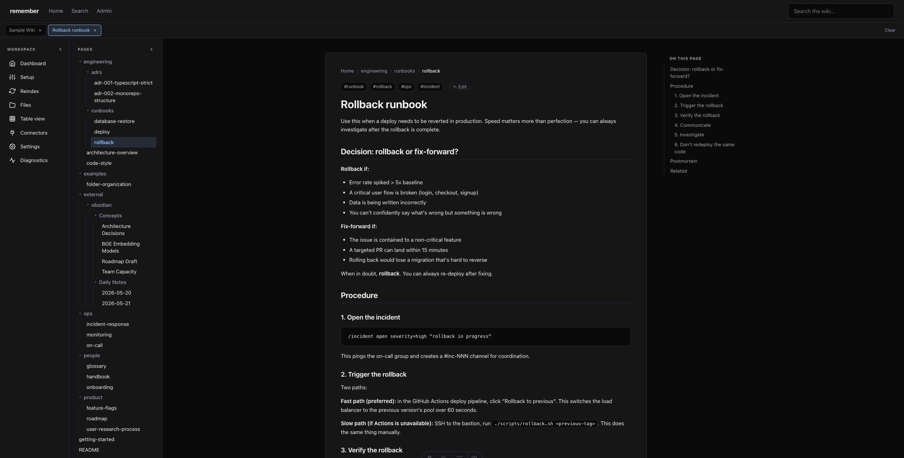
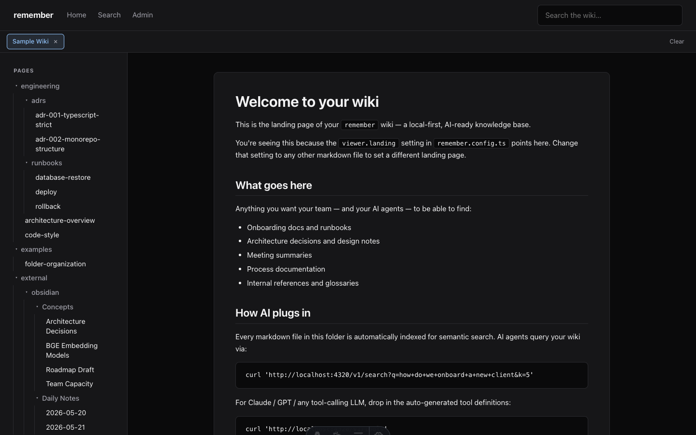
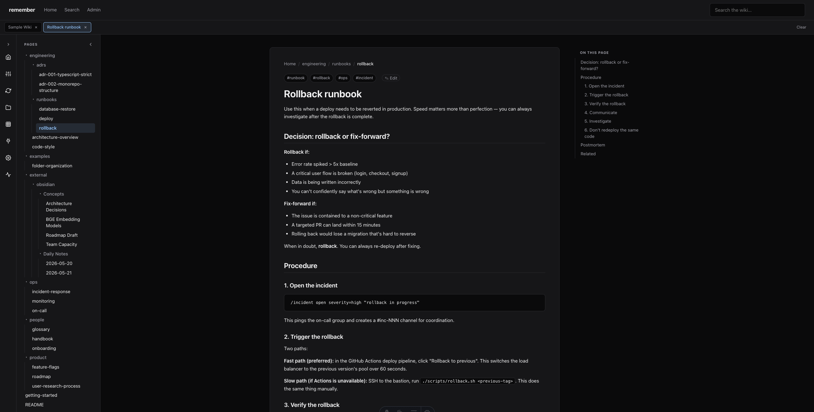
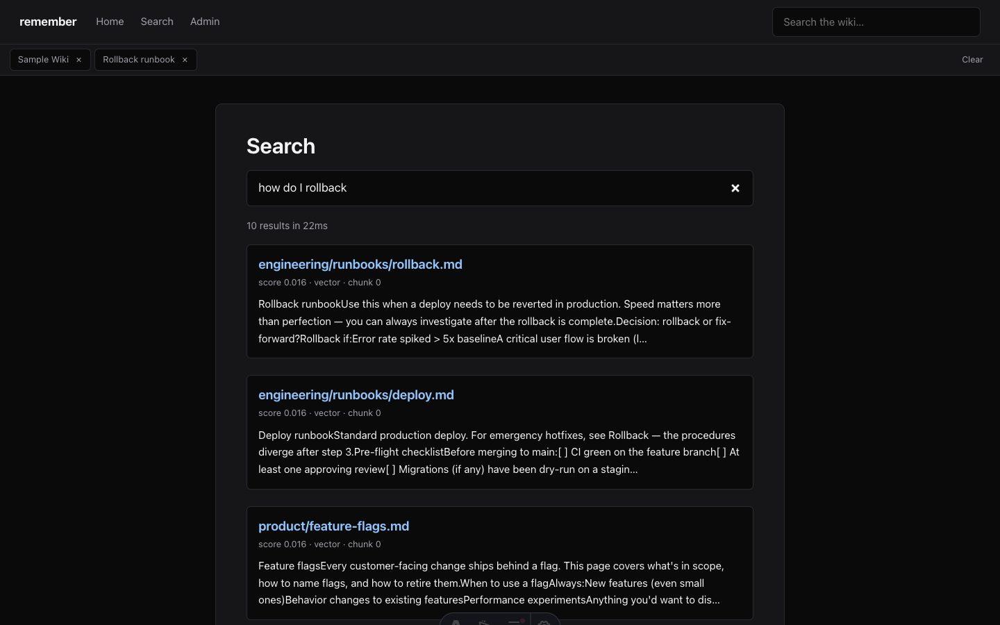
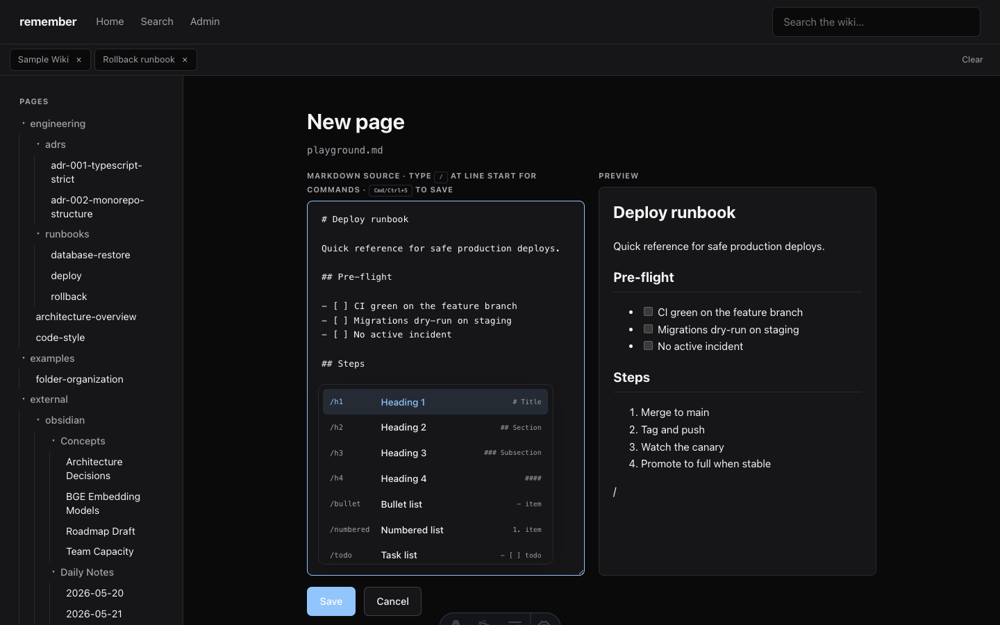
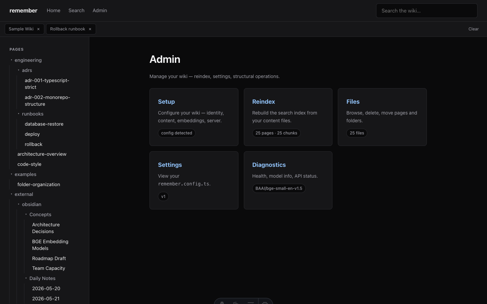
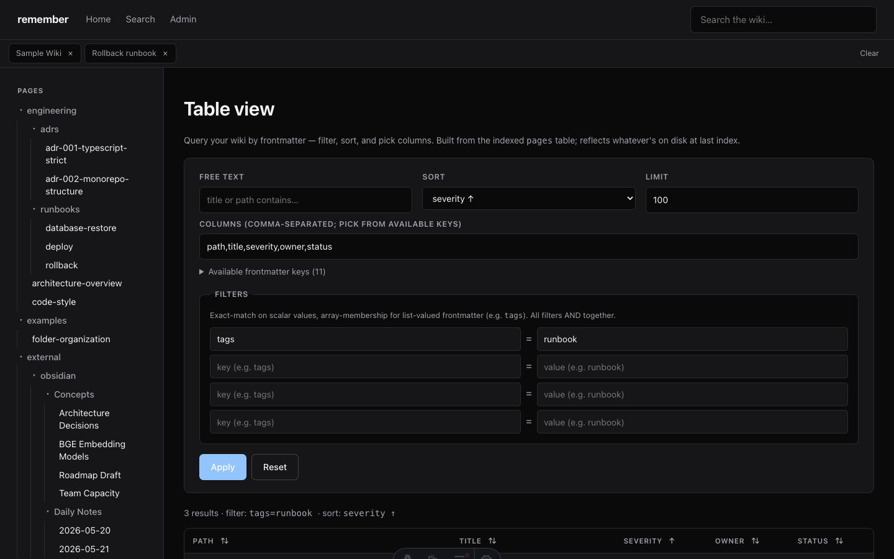
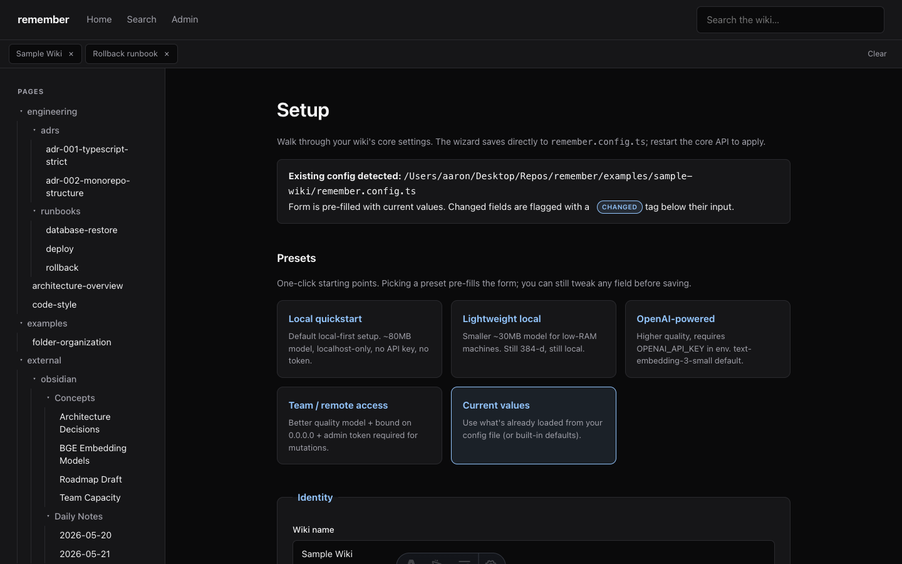
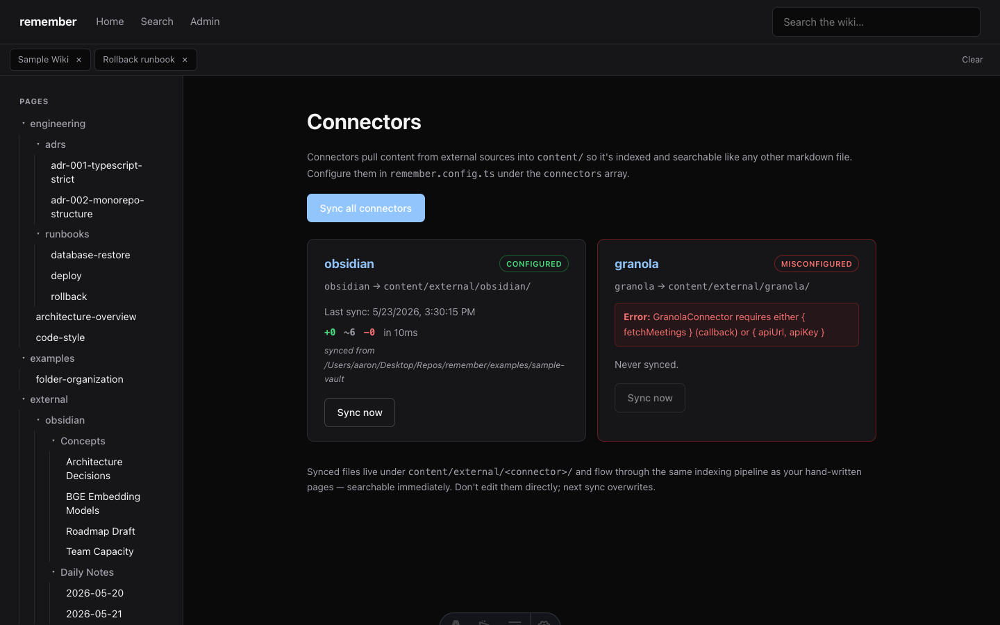

<div align="center">

# remember

**Your wiki. Your data. Your AI. Local-first.**

A free, open-source, AI-ready wiki platform. Markdown in, hybrid search out — running entirely on your machine in under 60 seconds.

[](https://github.com/aakusch/remember/actions/workflows/ci.yml)
[](./LICENSE)
[](.nvmrc)

[Quickstart](#quickstart) · [Tour](#a-quick-tour) · [Tutorial](./docs/getting-started.md) · [Architecture](./docs/architecture.md)

</div>

<br>



<br>

## Quickstart

```bash
npx @useremember/core init my-wiki
cd my-wiki
pnpm install     # or: npm install
pnpm dev
```

Then open **<http://localhost:4321>**.

That's the entire install. No API keys required. Zero outbound network calls in the default configuration. The bundled ONNX embedding model downloads once on first index (~80 MB) and is cached locally.

Other install paths: [from source](#from-source) · [Docker](#docker).

<br>

## What it does

| | |
|---|---|
| **Hybrid search** | BM25 (sqlite FTS5) + vector (sqlite-vec) + Reciprocal Rank Fusion. ~2 ms per query on a typical wiki. |
| **Local embeddings** | Bundled `BAAI/bge-small-en-v1.5` ONNX model (384-d). OpenAI is opt-in via `OPENAI_API_KEY`. |
| **AI tool definitions** | `GET /v1/tools` returns Anthropic/OpenAI-shaped definitions — drop into a tool-use call. |
| **Browser editor** | Split-pane markdown + live preview. Slash command palette (`/h1`, `/code`, `/table`, `/mermaid`, 16 more). `⌘/Ctrl+S` saves. |
| **Table view** | Query frontmatter as a sortable, filterable table. Bookmark URLs as saved views. |
| **Multi-tab nav** | Sticky tab strip persisted in `localStorage`. Up to 12 tabs. |
| **Live reload** | Filesystem watcher → incremental reindex → SSE → viewer auto-refreshes. Edits in your editor of choice show up in <1 s. |
| **Connectors** | Pull external sources (Obsidian vault, Granola meetings, any folder) into the same searchable index. |
| **Setup wizard** | Browser-based config with presets, model dropdown, and a "CHANGED" diff against the loaded config. Writes `remember.config.ts` directly. |
| **Filesystem-canonical** | Plain markdown in a directory. Plays with Obsidian, Cursor, VS Code, Dropbox, git. No proprietary format. |
| **Pluggable** | Walker · Parser · Chunker · Embedder · Store · SearchEngine · Reranker · Connector — every adapter has a documented interface. |
| **MIT licensed** | Use it for anything. |

<br>

## A quick tour

### Landing page

The viewer renders the configured landing markdown (`viewer.landing` in `remember.config.ts`, defaults to `README.md`). Sidebar tree shows the full folder hierarchy; tabs at the top track your open pages.



### Two collapsible left rails

Two independent left panels — a **Workspace rail** with icon-based admin links (Dashboard, Setup, Reindex, Files, Table view, Connectors, Settings, Diagnostics) and a **Pages tree** showing your wiki hierarchy. Each panel collapses to a narrow strip with a single chevron toggle; state persists in `localStorage` across reloads.


Collapsed state — both rails shrunk to single-button strips, maximum content width:



### Page detail

Every content page gets breadcrumbs, frontmatter tags rendered as pills, a heading-anchored table of contents on the right, prev/next nav at the bottom, and an ✎ Edit pill that drops you into the browser editor.

### Hybrid search

Type into the search bar (top right of every page) or visit `/search`. Each result shows which retrievers contributed (BM25, vector, or both) and the fused score. Add `?debug=1` to the API URL for per-stage timings.



### In-browser editor with slash commands

Click ✎ Edit on any page. The editor has a markdown source pane and a live preview side-by-side. Type `/` at the start of a line for the command palette — 20 commands covering headings, lists, code blocks, tables, math, mermaid diagrams, frontmatter scaffolds, and more.



### Admin dashboard

`/admin` is the operator surface. Each card is a workflow: setup, reindex, structural file ops, table view, connectors, config display, diagnostics.



### Table view — query frontmatter as data

Define your taxonomy in YAML frontmatter, then slice it however you want. Filter rules AND together; sort by any column (system or frontmatter); pick columns; bookmark the URL to save the view.



### Setup wizard

`/admin/setup` builds a `remember.config.ts` interactively. Pick from 4 preset profiles (local quickstart, lightweight local, OpenAI-powered, team/remote with auto-generated admin token), tune any field, and save directly to disk with a timestamped `.bak` backup.



### Connectors

Pull external markdown sources into your index. The ObsidianConnector walks a vault and rewrites `[[wikilinks]]`; the GranolaConnector pulls meetings via HTTP/API; the FilesystemConnector syncs any folder. Synced files land under `content/external/<connector>/` and flow through the normal indexing pipeline.



<br>

## How AI plugs in

Two patterns, no special integration:

**Pattern A — raw HTTP** (any client that can `curl`):

```bash
curl 'http://localhost:4320/v1/search?q=how+do+I+rollback&k=5'
```

```json
{
  "query": "how do I rollback",
  "results": [
    {
      "path": "engineering/runbooks/rollback.md",
      "snippet": "Use this when a deploy needs to be reverted…",
      "score": 0.0328,
      "retrievers": ["bm25", "vector"],
      "frontmatter": { "severity": "high", "owner": "platform" }
    }
  ],
  "query_ms": 3
}
```

**Pattern B — drop-in tool definitions** (Claude, GPT, any tool-calling LLM):

```bash
curl http://localhost:4320/v1/tools
```

Returns Anthropic/OpenAI-compatible tool definitions for `search_wiki`, `get_page`, `list_pages`. Drop them straight into a tool-use call — no wiring code needed.

<br>

## Connectors

Pull external sources into the same indexed corpus:

```ts
// remember.config.ts
import { defineConfig, defaults } from '@useremember/core';

export default defineConfig({
  connectors: [
    defaults.connector.obsidian({
      vaultPath: '~/Documents/Obsidian Vault',
      transformWikilinks: true,
      tag: 'obsidian',
    }),
    defaults.connector.granola({
      apiUrl: process.env.GRANOLA_API_URL,
      apiKey: process.env.GRANOLA_API_KEY,
      since: '2026-01-01',
      tag: 'meeting',
    }),
  ],
});
```

The connector manager runs an initial sync on boot, then exposes per-connector and "sync all" triggers through `/v1/connectors` and `/admin/connectors`.

<br>

## Install options

### Quickstart (recommended)

```bash
npx @useremember/core init my-wiki
cd my-wiki
pnpm install
pnpm dev
```

### From source

For working on `remember` itself, or running against the bundled sample wiki:

```bash
git clone https://github.com/aakusch/remember.git
cd remember
pnpm install
pnpm --filter @useremember/core build
./scripts/dev.sh                  # runs core + viewer side by side
```

The `scripts/dev.sh` helper starts the API on :4320 against `examples/sample-wiki/` (25 pages, frontmatter-rich, runbook + ADR + product + people content), then the Astro viewer on :4321.

### Docker

```bash
docker compose up
```

See [`docker-compose.yml`](./docker-compose.yml) for volume mounts and env vars. The image is multi-stage (build in Node 20-slim, runtime is also slim with the build artifacts copied over) and runs `remember start` by default. Healthcheck on `/v1/health` every 15 s.

<br>

## Configuration

Minimum:

```ts
import { defineConfig } from '@useremember/core';
export default defineConfig({});
```

Everything has sensible defaults. Use the in-browser **Setup wizard** at `/admin/setup` to build a config interactively, or hand-write one referencing [`examples/sample-wiki/remember.config.ts`](./examples/sample-wiki/remember.config.ts) for a comprehensive example.

Full schema reference: [`docs/getting-started.md#configuration-reference`](./docs/getting-started.md#configuration-reference).

<br>

## Architecture

Two packages, one pnpm-workspaces monorepo:

- **`@useremember/core`** — headless engine. CLI + HTTP API + indexer + search + adapters. Node-only. Standalone-usable.
- **`@useremember/viewer`** — Astro 5 SSR browser UI. Optional; bring your own UI if you want.

```
┌─────────────────────┐         ┌─────────────────────┐
│   @useremember/core    │  HTTP   │  @useremember/viewer   │
│  ─────────────────  │ ◄─────► │  ─────────────────  │
│  • CLI              │   SSE   │  • Astro + React    │
│  • Indexer          │         │  • Renderer         │
│  • HTTP API (Hono)  │         │  • Editor           │
│  • Embedder         │         │  • Admin            │
│  • SQLite + vec0    │         │  • Table view       │
│  • Connectors       │         │  • Setup wizard     │
└─────────────────────┘         └─────────────────────┘
```

Full architecture deep dive: [`docs/architecture.md`](./docs/architecture.md).

<br>

## Roadmap

| Version | Highlights |
|---|---|
| **v0.0.1** | Lean local-first OSS — *current* |
| v0.1 | Cross-encoder reranker, brew tap, standalone binary, curl install one-liner |
| v0.2 | Block-level references, backlinks panel, branding/theme |
| v0.3 | RBAC + OIDC/SAML auth |
| **v1.0** | First production-stable release |
| v2.0 | **Cloud premium** — managed multi-tenant SaaS with pgvector + S3 + team workspaces |

See [`CHANGELOG.md`](./CHANGELOG.md) for the full wave-by-wave history.

<br>

## Why this vs alternatives

- **vs Obsidian** — `remember` runs a server, so it has a real HTTP API and a hybrid search index. Obsidian is desktop-only with no programmatic surface for AI agents.
- **vs Notion / Confluence** — your files, your machine, your AI. No cloud lock-in, no per-seat pricing, no API rate limits.
- **vs SiYuan** — markdown-canonical, not a proprietary `.sy` format. Plays nicely with git, Cursor, VS Code, Obsidian — anything that reads `.md`.
- **vs Outline / BookStack** — designed *for* AI integration from day one. `/v1/tools` ships out of the box; you don't have to bolt on a separate AI layer.

<br>

## Contributing

`remember` is small and friendly. Start with [`CONTRIBUTING.md`](./CONTRIBUTING.md) for the dev setup, then check [issue templates](./.github/ISSUE_TEMPLATE/) for bug reports and feature requests.

PRs welcome on:

- New connector implementations (`@useremember/core/connectors/<name>.ts`)
- New embedder providers (Voyage, Cohere, etc.)
- New rerankers (cross-encoder, LLM-based)
- New viewer themes / layouts
- New API clients (Python, Go, Rust)
- Documentation improvements

Tagged `good-first-issue` are the easiest entry points.

<br>

## License

[MIT](./LICENSE) — use it for anything, commercial or otherwise.

<br>

<div align="center">

<sub>Made with care. Local-first by design.</sub>

</div>
